# About ii

Coding Coop in New Zealand

-   Focus on Cooperative Coding
-   Pairing is Sharing
-   ii.coop

## People

-   Hippie Hacker
-   Caleb Woodbine
-   Zach Mandeville
-   Stephen Heywood
-   Berno Kleinhans
-   Riaan Kleinhans

# INTRO

## What is Kubernetes Conformance?

CNCF Kubernetes Conformance ensures

> &#x2026; that every vendor’s version of Kubernetes supports the required APIs, as do open source community versions

<div class="notes">
It's good to have shared expectations of an API, regardless of who's hosting it for you.

</div>

## Conformance website

<https://cncf.io/ck>

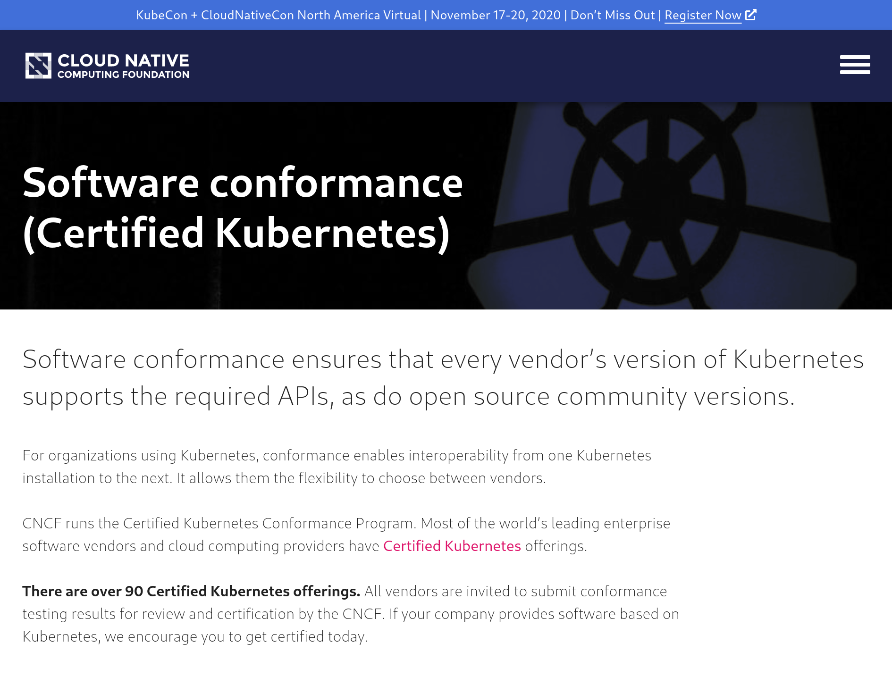

## k8s-conformance repo

<https://github.com/cncf/k8s-conformance>

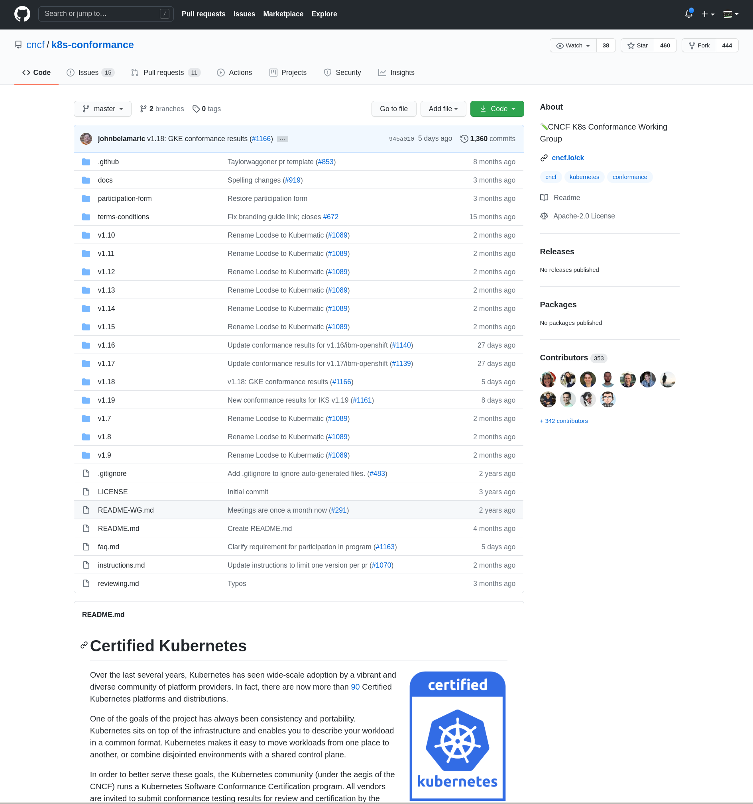

## Why is Kubernetes Conformance important?

Conformance with Kubernetes ensures:

-   portability of workloads
    -   stable APIs behave the same everywhere
-   freedom from vendor lock-in
    -   consistency with APIs

<div class="notes">
I expectate my workloads to running anywhere k8s does, regardless of vendor.

</div>

### Who can meet your k8spectations?

Currently, there are ~67 certified distributions.

[landscape.cncf.io](https://landscape.cncf.io/category=platform&format=card-mode&grouping=category)

Click **Certified K8s/KCSP/KTP** link on the left


# How do I certify my k8s distribution?

### Creating your Conformance Submission

[cncf/k8s-conformance /instructions.md](https://github.com/cncf/k8s-conformance/blob/master/instructions.md)

    vX.Y/$dir/README.md: how to reproduce your results.
    vX.Y/$dir/e2e.log: Test log output (from Sonobuoy).
    vX.Y/$dir/junit_01.xml: Machine-readable test log (from Sonobuoy).
    vX.Y/$dir/PRODUCT.yaml: Details of your PRODUCT

<div class="notes">
Four files

-   docs to reproduce
-   product metadata
-   two types of logs

</div>

### Document How to Bring test your cluster

Example **README.md** with instructions:

[cncf/k8s-conformance/tree/master/v1.18/kind](https://github.com/cncf/k8s-conformance/tree/master/v1.18/kind)

```tmate
time ./kind-run.sh 1.18.0
```

<div class="notes">
run next two code block

</div>

### Sonobuoy Logs

```tmate
sonobuoy logs -f
```

### Watch Sonobuoy

```tmate
watch kubectl get all --all-namespaces
```

### Sonobuoy Results

```tmate
find v1.*/plugins/e2e/results/global
```

    v1.18.0_2020-10-20_14:34.00/plugins/e2e/results/global
    v1.18.0_2020-10-20_14:34.00/plugins/e2e/results/global/junit_01.xml
    v1.18.0_2020-10-20_14:34.00/plugins/e2e/results/global/e2e.log

### Submit cncf/k8s-conformance results

<div class="notes">
Run next code block

</div>

[cncf/k8s-conformance instructions.md#uploading](https://github.com/cncf/k8s-conformance/blob/master/instructions.md#uploading)

### Fork+Branch+Remote

```tmate
git clone https://github.com/cncf/k8s-conformance
cd k8s-conformance
git remote add ii git@github.com:ii/k8s-conformance
git checkout -b notkind-v1.18
```

### Copy results into place

```tmate
cp -a ../notkind v1.18/notkind
cp -a ../v1.*/plugins/e2e/results/global/* v1.18/notkind
git status
```

### Commit and Push Results

```tmate
git add v1.18/notkind
git commit -m 'Conformance results for v1.18/notkind'
git push ii notkind-v1.18
```

### Open a PR to cncf/k8s-conformance

[cncf/k8s-conformance/compare/master&#x2026;your:branch](https://github.com/cncf/k8s-conformance/compare/master...ii:notkind-v1.18-test)

### Contents of the PR

```bash
git diff --name-only origin/master
```

```bash
v1.18/notkind/PRODUCT.yaml
v1.18/notkind/README.md
v1.18/notkind/e2e.log
v1.18/notkind/junit_01.xml
```

<div class="notes">
This will allow the CNCF and the community to verify your submission includes all the test results and metadata required for conformance.

</div>

# DEEP DIVE

Gaps in Kubernetes Conformance Coverage

-   Identify
-   Close
-   Prevent

<div class="notes">
switch obs scene to INTRO

</div>

# Identifying Gaps in Kubernetes Conformance Coverage

## <https://apisnoop.cncf.io>


## snoopDB

[Database Setup](https://github.com/cncf/apisnoop/blob/master/apps/snoopdb/tables-views-functions.org#basic-database-setup) Schemas:

-   **public:** from k/k [swagger.json](https://github.com/kubernetes/kubernetes/tree/master/api/openapi-spec)
-   **conformance:** CI job [api-audit.logs](https://gcsweb.k8s.io/gcs/kubernetes-jenkins/logs/ci-kubernetes-gce-conformance-latest/1319331777721929728/artifacts/bootstrap-e2e-master/)
-   **testing:** from live in-cluster usage

<div class="notes">
How can I deploy snoopdb in my cluster and ask my own questions about the API shape and usage?

</div>

## How can I deploy snoopdb?

**MANY** ways to deploy, one `kind` way:

```bash
git clone https://github.com/cncf/apisnoop
cd apisnoop/kind
kind create cluster --config=kind+apisnoop.yaml
kubectl wait --for=condition=Ready --timeout=600s \
  --selector=app.kubernetes.io/name=auditlogger pod
```

## Schemas

        Name     |  Size   |                       Description
    -------------|---------|----------------------------------------------------------
     audit_event | 884 MB  | every event from an e2e test run, or multiple test runs.
     open_api    | 5080 kB | endpoint details from openAPI spec

## Loading K8s API into SQL

-   **SnoopDB:** [loads the OpenAPI swagger.json](https://github.com/cncf/apisnoop/blob/master/apps/snoopdb/postgres/snoopUtils.py#L290-L292)

```python
swagger_url = K8S_GITHUB_REPO + commit_hash + \
  '/api/openapi-spec/swagger.json'
openapi_spec = load_openapi_spec(swagger_url)
```

## OpenAPI Table

-   **K8s API definition:** shape of API

```sql-mode
\d open_api ; describe table
```

```example
    Column    |            Type             |
--------------|-----------------------------+
 release      | text                        |
 release_date | timestamp without time zone |
 endpoint     | text                        |
 level        | text                        |
 category     | text                        |
 path         | text                        |
 k8s_group    | text                        |
 k8s_version  | text                        |
 k8s_kind     | text                        |
 k8s_action   | text                        |
 deprecated   | boolean                     |
 description  | text                        |
 spec         | text                        |
```

## PSQL Example Query

Newly Stable Endpoints

```bash
export PGUSER=apisnoop PGHOST=localhost
```

```bash
psql -c "with endpoint_and_first_release as (
 select endpoint, level,
 (array_agg(release order by release::semver))[1]
    as first_release
  from open_api group by level, endpoint)
select level, endpoint, first_release
  from endpoint_and_first_release
 where first_release = '1.20.0' and level='stable';"
```

     level  |           endpoint           | first_release
    --------|------------------------------|---------------
     stable | getInternalApiserverAPIGroup | 1.20.0
    (1 row)

## Audit CI logs in a DB

-   SnoopDB loads recent CI audit logs
-   Query Test Job K8s API Usage

## kind-conformance-audit job

[testgrid.k8s.io/sig-arch-conformance#kind-conformance-audit](https://testgrid.k8s.io/sig-arch-conformance#kind-conformance-audit)

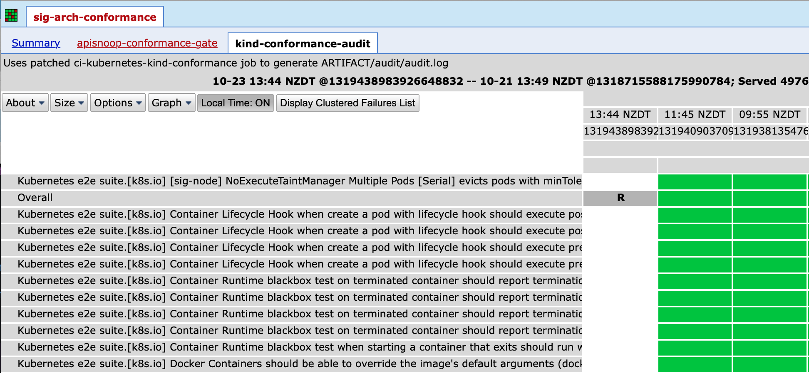

## AuditEvent Table

-   **K8s API definition:** shape of API

```sql-mode
\d audit_event ; describe table
```

```example
    Column     |            Type             |
---------------|-----------------------------+
 release       | text                        |
 release_date  | text                        |
 audit_id      | text                        |
 endpoint      | text                        |
 useragent     | text                        |
 test          | text                        |
 test_hit      | boolean                     |
 conf_test_hit | boolean                     |
 data          | jsonb                       |
 source        | text                        |
 id            | integer                     |
 ingested_at   | timestamp without time zone |
```

## Prow Job Audit Logs

By default we load recent conformance prow jobs

```sql-mode
select distinct release,
                split_part(source,'/',8) as "prow-job"
  from audit_event
 where source like 'https://prow.k8s.io%';
```

```example
 release |               prow-job
---------|--------------------------------------
 1.20.0  | ci-kubernetes-gce-conformance-latest
 1.20.0  | ci-kubernetes-e2e-gci-gce
(2 rows)

```

## e2e.test framework support

-   UserAgent updated to include test name
-   AuditLogs include test and operation

## Conformance Tests

```sql-mode
select distinct test
  from audit_event
  where test ilike '%Conformance%'
  limit 5
  ;
```

```example
                                                                                 test
----------------------------------------------------------------------------------------------------------------------------------------------------------------------
 [sig-storage] Projected secret should be able to mount in a volume regardless of a different secret existing with same name in different namespace [NodeConformance]
 [sig-storage] Subpath Atomic writer volumes should support subpaths with configmap pod [LinuxOnly] [Conformance]
 [sig-network] Services should provide secure master service  [Conformance]
 [sig-network] Networking Granular Checks: Pods should function for intra-pod communication: udp [NodeConformance] [Conformance]
 [sig-api-machinery] Secrets should fail to create secret due to empty secret key [Conformance]
(5 rows)

```

## New Endpoints in 1.20

<https://apisnoop.cncf.io>

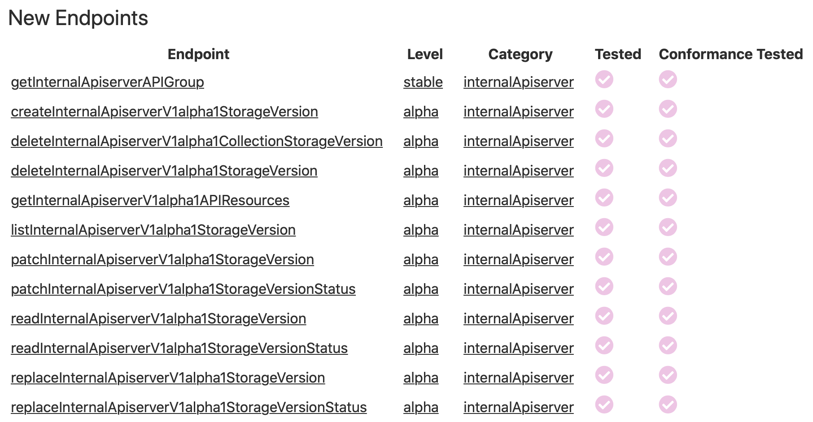

## Coverage at Time of Release

<https://apisnoop.cncf.io/conformance-progress>

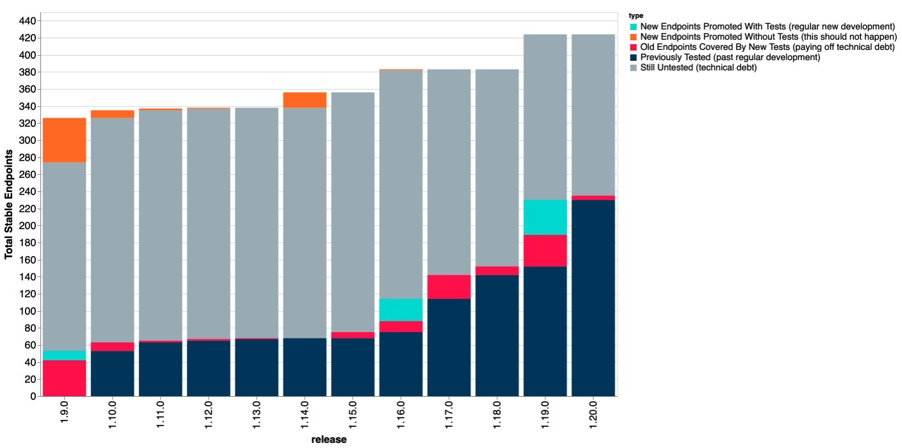

<div class="notes">
This graph shows about 3 years of work. The conformance program was initiated during 1.9 and ii started writing tests at around 1.15. We color in the grey with red, to fill in the debt (aka gaps) in coverage.

</div>

## Current Conformance Debt

<https://apisnoop.cncf.io/conformance-progress>

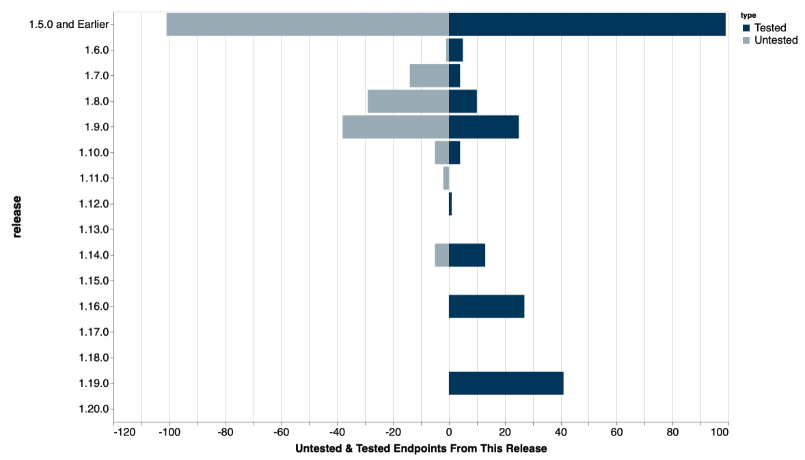

<div class="notes">
The current conformance debt shows how old our debt is, and how much remains. We hope to clear all debt back to 1.11 by the time we cut the 1.20 release.

</div>

# Closing gaps in Kubernetes Conformance Coverage

## Identifying an untested features

```sql-mode
SELECT
  endpoint,
  -- k8s_action,
  -- path,
  -- description,
  kind
  FROM testing.untested_stable_endpoint
  where eligible is true
  and category = 'core'
  order by kind, endpoint desc
  limit 5;
```

```example
             endpoint             |  kind
----------------------------------|---------
 createCoreV1NamespacedPodBinding | Binding
 createCoreV1NamespacedBinding    | Binding
 replaceCoreV1NamespacedEvent     | Event
 readCoreV1NamespacedEvent        | Event
 patchCoreV1NamespacedEvent       | Event
(5 rows)

```

<div class="notes">
We start with a query to focus on specific untested endpoints. Here we search for the first 5 stable/core endpoints, which are eligible for conformance, but lack tests.

</div>

## Discover docs on target endpoints

-   [Kubernetes API Reference Docs](https://kubernetes.io/docs/reference/kubernetes-api/)
-   [client-go - corev1](https://github.com/kubernetes/client-go/blob/master/kubernetes/typed)
    
    <div class="notes">
    Got endpoint, go to reference docs, thank sig-docs. Understand how to talk to the resource in the client-go corev1 folder.
    
    </div>

## Describe the outline

To test through the lifecycle of a resource:

1.  Create a RESOURCENAME

2.  Patch the RESOURCENAME

3.  Get the RESOURCENAME

4.  List all RESOURCENAMEs

5.  Delete RESOURCENAME

<div class="notes">
Here's an outline of the test we will write. It's often the lifecycle of the resource.

Hippie Interupts: This allows discussion of the approach without needing to have a fully fleshed out test yet.

</div>

## Write a mock test

Prove coverage change by exercising the endpoints:

```go
fmt.Println("creating a Pod")

// ... declare the test pod resource

_, err = ClientSet
           .CoreV1().Pods(testNamespaceName)
           .Create(context.TODO(),
                   &testPod,
                   metav1.CreateOptions{})
if err != nil {
    fmt.Println(err, "failed to create Pod")
    return
}
```

<div class="notes">
At this point we don't yet use the e2e test suite, as this code is exported into our tickets before writing a PR.

</div>

## Validate the coverage change

List endpoints hit by the test:

```sql-mode
select * from testing.endpoint_hit_by_new_test;
```

```example
     useragent     |           endpoint            | hit_by_ete | hit_by_new_test
-------------------|-------------------------------|------------|-----------------
 live-test-writing | createCoreV1NamespacedPod     | t          |               4
 live-test-writing | deleteCoreV1NamespacedPod     | t          |               4
 live-test-writing | listCoreV1PodForAllNamespaces | t          |               4
(3 rows)

```

<div class="notes">
We run the mock-test in cluster, and set the useragent to 'live-test-writing' which allows us to see what new/untested endpoints are hit by our test-to-be.

</div>

## Display endpoint coverage change

```sql-mode
select change_in_number
from testing.projected_change_in_coverage;
```

```example
 change_in_number
------------------
                0
(1 row)

```

<div class="notes">
This test wasn't effective enough.

Pods are already covered in conformance.

</div>

## Submitting a mock ticket

-   exported as Markdown
-   submitted as GitHub issues.

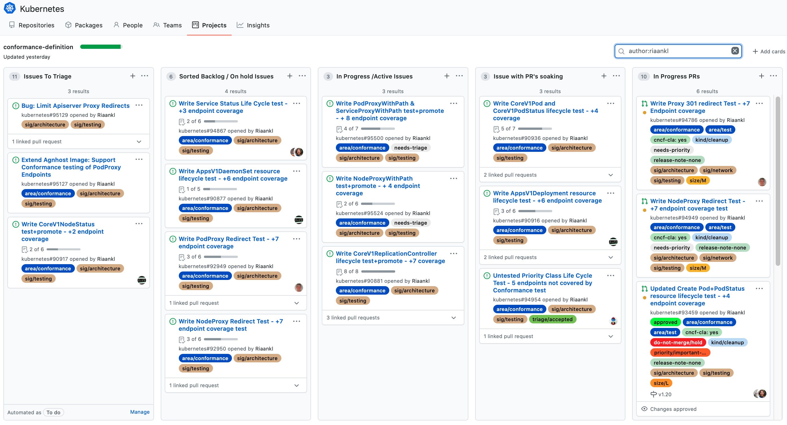

# Preventing gaps in Kubernetes Conformance Coverage

## testgrid.k8s.io

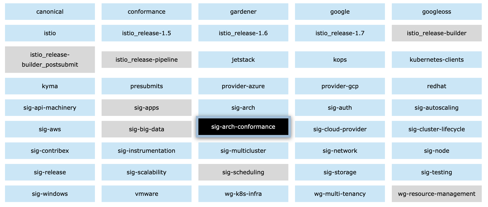

## sig-arch / conformance prow jobs

[kubernetes/test-infra config/jobs/kubernetes/sig-arch](https://github.com/kubernetes/test-infra/tree/master/config/jobs/kubernetes/sig-arch)


## apisnoop-conformance-gate

[Eventually Release Blocking Conformance Job](https://github.com/kubernetes/test-infra/blob/master/config/jobs/kubernetes/sig-arch/conformance-gate.yaml)

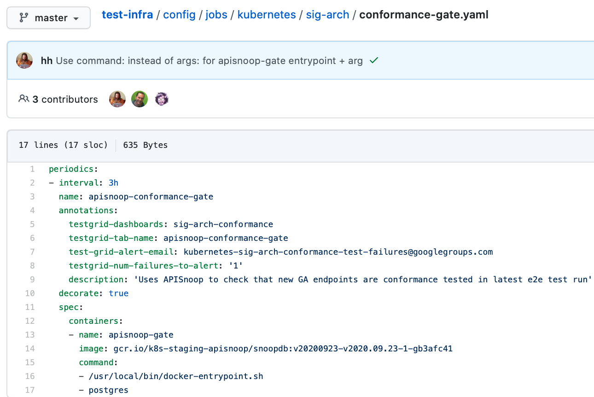

## Job Fails and Emails

Any new gaps in coverage are detected

```yaml
name: apisnoop-conformance-gate
annotations:
  testgrid-dashboards: sig-arch-conformance
  testgrid-tab-name: apisnoop-conformance-gate
  test-grid-alert-email: kubernetes-sig-arch-conformance-test-failures@googlegroups.com
  testgrid-num-failures-to-alert: '1'
  description: 'Uses APISnoop to check that new GA endpoints are conformance tested in latest e2e test run'
```

<div class="notes">
This job will help us notify sig-release that there is a new API that must have Conformance Tests OR be reverted before a release can happen.

</div>

# DEEP DIVE Summary

Gaps in Kubernetes Conformance Coverage

-   **Identify:** using apisnoop.cncf.io + snoopdb
-   **Close:** using humacs in-cluster workflow
-   **Prevent:** release blocking jobs

# Verifying Conformance Submissons

prow.cncf.io

Remember our PR submission from earlier?

## Results submitted

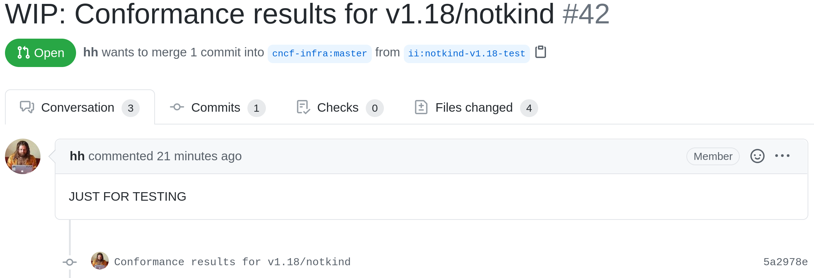

## CNCF CI comments

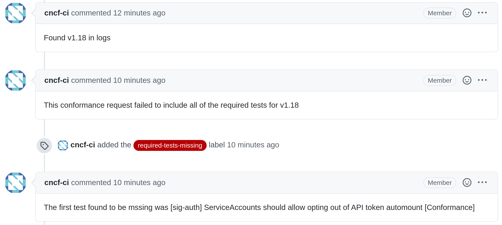

## Informational labels


## Certified distributions

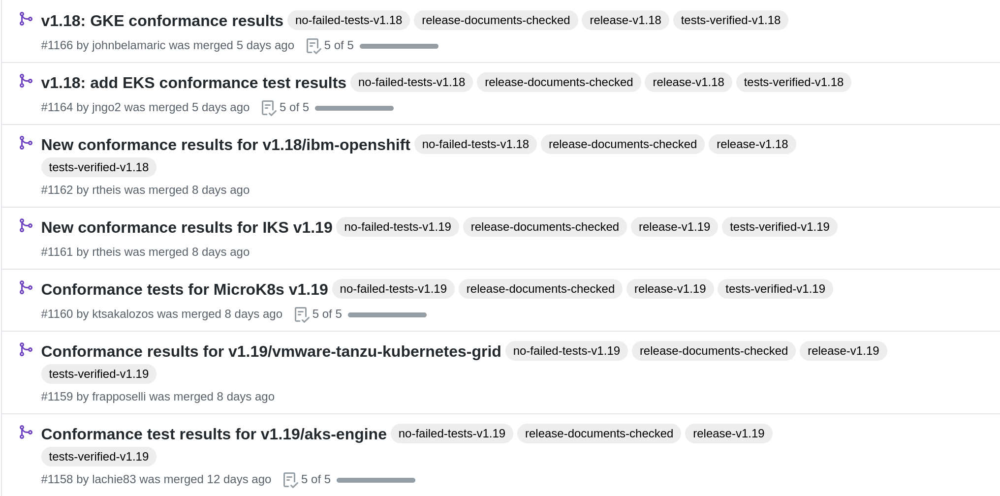

## Certified Logo (tm)

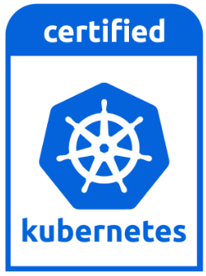

# Q&A

-   <https://cncf.io/ck>
-   <https://apisnoop.cncf.io>
-   <https://testgrid.k8s.io>
-   <https://github.com/cncf/k8s-conformance>
-   <https://github.com/cncf/apisnoop>
